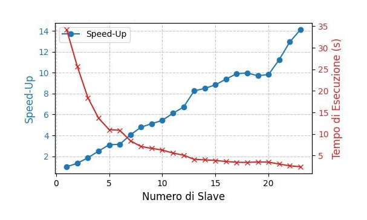
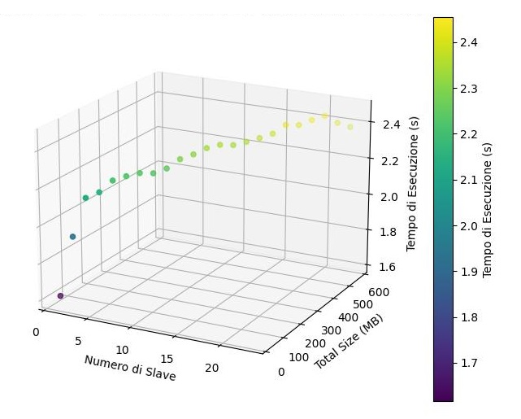

# Word Count
Questo progetto è stato sviluppato per l'esame di Programmazione Concorrente, Parallela e su Cloud 2022-2023.

- Studente: **Domenico Rossi**
- Matricola: **0522500902**
- Project ID: **2**

## **Indice** ##
- [**Introduzione al problema**](#introduzione-al-problema)
- [**Configurazione ed Esecuzione**](#configurazione-ed-esecuzione)
  - [**Configurazione**](#configurazione)
  - [**Esecuzione**](#esecuzione)
- [**Analisi del problema**](#analisi-del-problema)
  - [**Soluzione proposta**](#soluzione-proposta)
    - [**Calcolo della dimensione totale dei file**](#calcolo-della-dimensione-totale-dei-file)
    - [**Divisione in partizioni**](#divisione-in-partizioni)
    - [**Invio delle partizioni**](#invio-delle-partizioni)
    - [**Ricezione delle partizioni e conteggio**](#ricezione-delle-partizioni-e-conteggio)
    - [**Invio delle partizioni locali**](#invio-delle-partizioni-locali)
    - [**Ricezione e merge dei risultati**](#ricezione-e-merge-dei-risultati)
    - [**Trascrizione dei risultati**](#trascrizione-dei-risultati)
- [**Implementazione**](#implementazione)
    - [**Dimensione dei file**](#dimensione-dei-file)
    - [**Troncamento delle parole tra partizioni**](#troncamento-delle-parole-tra-partizioni)
    - [**MASTER: Invio delle partizioni**](#master-invio-delle-partizioni)
    - [**SLAVE: Ricezione partizioni e conteggio locale**](#slave-ricezione-partizioni-e-conteggio-locale)
    - [**SLAVE: Invio dei conteggi locali**](#slave-invio-dei-conteggi-locali)
    - [**MASTER: Ricezione e merge dei risultati**](#master-ricezione-e-merge-dei-risultati)
        - [**Aggiornamento dell'istogramma globale**](#aggiornamento-dell-istogramma-globale)
    - [**MASTER: Scrittura dei risultati in un file CSV**](#master-scrittura-dei-risultati-in-un-file-csv)
- [**Flusso di comunicazione MPI**](#flusso-di-comunicazione-mpi)  
  - [**Master**](#master)
  - [**Slave**](#slave)     
- [**Benchmarking**](#benchmarking)
  - [**Scalabilità Forte**](#scalabilità-forte)
  - [**Scalabilità Debole**](#scalabilità-debole)
  - [**Risultati Ottenuti**](#risultati-ottenuti)
- [**Conclusioni**](#conclusioni)


## **Introduzione al problema**

Il codice fornito implementa un programma di conteggio delle parole utilizzando il paradigma di programmazione parallela MPI (Message Passing Interface). Il programma è progettato per contare le occorrenze delle parole presenti in una directory di file di testo.
Progettato per contare le parole in modo parallelo, apportando notevoli vantaggi in termini di velocità ed efficienza. L'uso della parallelizzazione consente di elaborare il testo più rapidamente, coinvolgendo contemporaneamente più processori o nodi di calcolo. Questa capacità ottimizzata di elaborazione lo rende particolarmente adatto anche per testi lunghi. Grazie alla sua implementazione parallela, il conteggio delle parole avviene in modo efficiente, contribuendo a migliorare significativamente le prestazioni di analisi del testo.


## **Configurazione ed Esecuzione**
Di seguito sono illustrati i passaggi necessari alla configurazione dell' ambiente e successivamente le istruzioni per l'esecuzione del programma.

## **Configurazione**
- Download dell' ambiente di sviluppo (ho usato Visual Studio Code, da qui denominato VSCode), adeguamente configurato con le opportune variabili d'ambiente.
- Necessario aver installato Docker sul proprio dispositivo
## **Esecuzione** :
- Windows: 

Si apra il terminale di VSCode, dopodichè si deve effettuare il run del container con la seguente istruzione (l'istruzione va su una singola riga):
```c
docker run --rm -it --name mpi-container --mount src="${PWD}",target=/home,type=bind spagnuolocarmine/docker-mpi:latest
```

Adesso è necessario spostarsi nella
directory home/docker-mpi/src del docker ed eseguire lo script install.sh, necessario ad installare tutte le librerie apposite
```c
cd home/docker-mpi/src
chmod +x install.sh
./install.sh
```
Arrivati a questo punto è possibile compilare il nostro codice, per questo ho utilizzato MakeFile, dunque andiamo a compilare con l'istruzione 
```c
make all
```

Adesso non ci resta altro che eseguire il codice, con l'apposito script di esecuzione automatizzata, in cui viene stabilito anche il numero di processori con il quale si vuole eseguire il nostro codice.

Nel terminale lanciamo dunque il comando
```c
chmod +x autorun.sh
./autorun.sh
```

Durante l'esecuzione,in logfile.txt sarà dunque possibile visualizzare le varie itereazioni di conteggio delle parole.

## **Analisi del problema**

L'obiettivo è sviluppare un algoritmo basato su MPI per il  conteggio di parole nei file presenti in una directory. La gestione dei dati avviene secondo il paradigma map-reduce. La responsabilità primaria del processo MASTER è effettuare la lettura completa di tutti i file situati in una specifica directory. Ai processi SLAVE viene distribuita equamente una porzione dei dati, provenienti dal processo MASTER. Una volta ottenuta la propria porzione, ogni processo SLAVE eseguirà il conteggio delle parole per determinare la frequenza di ciascuna parola all'interno dei propri dati. Ogni processo SLAVE mantiene un istogramma locale per tracciare le frequenze delle parole nel suo subset di dati. I risultati parziali dei processi SLAVE vengono successivamente inviati al processo MASTER. Qui, il processo MASTER si occupa di unire gli istogrammi parziali ricevuti da ciascun processo SLAVE attraverso un'operazione di merge. Infine, il processo MASTER genera un file CSV che contiene le frequenze delle parole, ordinato in ordine decrescente in base al count(frequenza). In istogramma_Globale_ordinato.csv viene scritto il risultato finale dell'intera elaborazione, ovvero la tabella hash globale, risultante dal merge degli istogrammi locali.

## **Soluzione Proposta** 
Nello sviluppo del codice proposto, la fase più critica riguarda la distribuzione equa delle partizioni di file tra i vari processi. Questa parte è fondamentale in quanto un adeguata divisione corrisponde a maggiore efficienza nello svolgere i task tra più processori. 
Per affrontare questa parte, ho considerato la dimensione in byte di ogni file, e dunque sommando quella di tutti i file della directory, ho ottenuto la size totale. Questa scelta porta ad evitare di scorrere tutti i file per determinare la divisione ed è ottimo in contesti in cui il numero di file è di grossa dimensione.


Il codice è suddiviso nelle seguenti fasi principali:
### **Calcolo della dimensione totale dei file** 
Il processo Master acquisisce dalla directory la dimensione totale di tutti i file su cui andrà ed eseguire l'analisi del conteggio delle parole.

### **Divisione in partizioni** 
Il processo Master ottenuta la dimensione totale di tutti i file, divide il contenuto  in partizioni eque tra i processi, ottenendo una media dei byte da assegnare a ciascun processo.

### **Invio delle partizioni**
Il processo Master una volta che ha diviso il contenuto in partizioni, invia a ciascuno Slave la propria partizione: partendo dalla prima, invia allo Slave con rank 1, la seconda partizione allo Slave con rank 2 e cosi via, fino a che lo Slave con rank N (num processi-1) riceve l'ultima partizione di dati.

### **Ricezione delle partizioni e conteggio**
A questo punto ogni Slave si mette in ricezione della propria porzione di dati ed effettua il conteggio delle parole.
Una parola letta per la prima volta verrà inserita nella hashtable locale dello Slave mentre una parola già presente nella stessa, incrementerà il conteggio delle occorrenze.

### **Invio delle partizioni locali**
Ogni Slave dopo aver terminato il conteggio delle parole nella propria partizione di dati, invia il risultato al processo Master.

### **Ricezione e merge dei risultati**
Il processo Master riceve tutti i conteggi locali inviati dagli Slave e procede ad effettuare il merge dei risultati.
Mano mano che arriva un conteggio da uno degli slave, nell' ordine di ricezione, il master effettua il conteggio globale:
in maniera simile a quanto avveniva localmente, il Master incrementa le occorrenze di parole già inserite nella sua hashtable globale, altrimenti setta a 1 le nuove parole.

### **Trascrizione dei risultati**
Dopo aver effettuato il merge, Nel Master viene effettuato l'ordinamento delle parole nell' array di occorrenze, in modo da trascrivere la hashtable finale in maniera ordinata, in base alle occorrenze, in un file CSV.

## **Implementazione**
Vediamo gli aspetti pratici dell' implementazione dell' algoritmo proposto per il conteggio delle parole all' interno di file .txt.

#### **Dimensione dei file**
L'acquisizione della dimensione totale dei file è ottenuta grazie alla funzione `get_total_file_size()`

Di seguito mostrata:

```c
long get_total_file_size(DIR *dir, const char *input_dir)
{
    long total_size = 0;
    struct dirent *entry;

    while ((entry = readdir(dir)) != NULL)
    {
        if (strcmp(entry->d_name, ".") == 0 || strcmp(entry->d_name, "..") == 0)
        {
            continue;
        }
        char filepath[1024];
        snprintf(filepath, sizeof(filepath), "%s/%s", input_dir, entry->d_name);

        if (stat(filepath, &info) == 0)
        {
            total_size += info.st_size;
        }
    }
    rewinddir(dir);
    return total_size;
}
```
in pratica si va all' interno della directory specificata e si va a fare la somma della dimensione di ogni file presente all' interno, incrementando ogni volta la variabile `total_size` che alla fine della funzione sarà uguale alla dimensione totale di tutti i file.

la dimensione totale, divisa per il numero di processi, ci da una stima di quella che è la dimensione di ogni partizione da inviare ai processi Slave.

#### **Troncamento delle parole tra partizioni**
Il numero di byte da assegnare ai processi deve però considerare un aspetto cruciale per il corretto funzionamento, ovvero il *troncamento della parola* tra diversi slave.
```c
Esempio:
Slave 1: dobbiamo evitare il tron
Slave 2: camento tra le varie parole 
```

la parola "troncamento" nell' esempio fornito è stata troncata nell'assegnazione dei byte ai vari Slave. Ciò deve essere evitato.

Di seguito c'è la distribuzione dei byte agli Slave:

```c
            long start_byte, end_byte;

            if (i == 1)
            {
                // Caso di invio a processo 1 (iniziale)
                start_byte = 0;
                end_byte = avg_partition_size + extra_bytes + 1;
            }
            else if (i < num_processes - 1)
            {
                // Caso di invio a processi intermedi
                start_byte = end_byte;
                end_byte = start_byte + avg_partition_size - 1;
            }
            else
            {
                // Caso di invio all'ultimo processo
                start_byte = end_byte;
                end_byte = total_size + 1;
            }

            // Rimuovi byte aggiuntivi per non troncare un'eventuale parola in lettura
            while (end_byte < total_size + 1 && all_data[end_byte] != ' ')
            {
                end_byte--;
            }

```
Ho diviso questa parte di implementazione, in 3 casi:

Caso 1: Processo con rank 0 (iniziale).

Caso 2: Eventuali Processi intermedi.

Caso 3: Processo finale.

In base al numero di processi usati per l'esecuzione, ciascun processo da 2 ad N ha il valore start_byte ed end_byte , che sono delle variabili di tipo intero, utilizzate per scorrere la posizione all' interno del contenuto di tutti i file, salvato in all_data.
Il primo processo partirà ovviamente dalla posizione corrispondende al byte 0, al quale sarà sommata la media dei byte ottenuta in precedenza più eventuali byte, ottenuti dal resto della divisione.
Il processi intermedi a loro volta partiranno dal byte immediatamente successivo, fino ad arrivare al proprio end_byte, anch'esso risultante dalla somma della media dei byte.
Infine il processo finale conterà le parole restanti fino al termine dell' ultimo file.

Per evitare che l'ultimo processo possa trovarsi nel caso in cui non abbia parole da contare, perchè eventualmente già contate  tutte dagli altri processi, ho gestito le parole in modo che, nell' evitare il troncamento delle parole tra diversi slave, l'end_byte dei processi viene decrementato, fino a trovare la parola intera precedente. In questo modo viene evitato correttamente il troncamento e la divisione tra byte garantisce che ogni processo utilizzato, abbia una porzione di dati equa.

#### **MASTER: Invio delle partizioni**
Per ottimizzare il codice e rendere efficiente l'utilizzo di più processi durante il conteggio, è stato utilizzato l'invio asincrono degli indici di inizio e fine per ciascuno Slave.
```c
// Calcola il numero effettivo di byte da inviare
long byte_count = end_byte - start_byte + 1;

// Invia start_byte, byte_count ai processi SLAVE
MPI_Isend(&start_byte, 1, MPI_LONG, i, 0, MPI_COMM_WORLD, &request_send_size[i - 1]);
MPI_Isend(&byte_count, 1, MPI_LONG, i, 0, MPI_COMM_WORLD, &request_send_buffer[i - 1]);
MPI_Isend(&end_byte, 1, MPI_LONG, i, 0, MPI_COMM_WORLD, &request_send_buffer[i - 1]);
MPI_Isend(all_data + start_byte, byte_count, MPI_CHAR, i, 0, MPI_COMM_WORLD, &request_send_buffer[i - 1]);
```

Per evitare che gli Slave richiedessero i dati prima che gli stessi fossero effettivamente inviati dal Master ho gestito la sincronizzazione tra i processi, utilizzando `Waitall()`
```c
MPI_Waitall(num_processes - 1, request_send_size, MPI_STATUSES_IGNORE);
MPI_Waitall(num_processes - 1, request_send_buffer, MPI_STATUSES_IGNORE);
```
L'invio asincrono consente al programma di continuare l'esecuzione senza dover attendere che l'operazione di invio sia completata, questo per ottimizzare ulteriormente la parallelizzazione.
Nello specifico La funzione MPI_Waitall aspetta il completamento di un array di richieste asincrone. Esse sono rappresentate dagli array request_send_size e request_send_buffer.

Dopo aver inviato le porzioni dei dati ai processi SLAVE in modo asincrono, la chiamata a MPI_Waitall garantisce che il programma principale (processo Master) attenda finché tutte le operazioni di invio asincrone non sono state completate. In questo modo, evito che le operazioni di invio non sono ancora state finalizzate quando si tenta di procedere con l'esecuzione del resto del codice.

Dunque, **MPI_Waitall** è utilizzato per sincronizzare il programma, garantendo che tutte le operazioni di invio asincrone siano terminate prima di proseguire nell'esecuzione del codice successivo.

#### **SLAVE: Ricezione partizioni e conteggio locale**
Gli Slave ricevono i dati , mediante `MPI_Recv()`

```c
MPI_Recv(&start_byte, 1, MPI_LONG, MASTER_RANK, 0, MPI_COMM_WORLD, MPI_STATUS_IGNORE);
MPI_Recv(&byte_count, 1, MPI_LONG, MASTER_RANK, 0, MPI_COMM_WORLD, MPI_STATUS_IGNORE);
MPI_Recv(&end_byte, 1, MPI_LONG, MASTER_RANK, 0, MPI_COMM_WORLD, MPI_STATUS_IGNORE);
```

e conseguentemente allocano un buffer per contenere l'effettiva porzione di dati, allocando esattamente lo spazio necessario, senza alcuno spreco di memoria, grazie al parametro byte_count.
```c
local_data = (char *)malloc(byte_count * sizeof(char));
MPI_Recv(local_data, byte_count, MPI_CHAR, MASTER_RANK, 0, MPI_COMM_WORLD, MPI_STATUS_IGNORE);
```

a questo punto, dopo aver inizializzato una hashtable locale,viene effettuato il conteggio locale delle parole, da parte di ogni Slave.

```c
        char *delimiters = " .,'";
        char *saveptr;
        char *token = strtok_r(local_data, delimiters, &saveptr);
        while (token != NULL)
        {
            updateWordCount(token, rank);
            token = strtok_r(NULL, delimiters, &saveptr); 
        }
```
Ho utilizzato dei delimitatori che servono a stabilire quando una parola è da considerare terminata: in questo caso ogni parola termina quando si incontra uno spazio oppure un punto o una virgola. Quindi usando `strtok_r()` si prende ogni singola parola.
Ciè è fondamentale perchè ogni token è passato alla funzione `updateWordCount()`, che si occupa del conteggio e quindi dell' inserimento nell' istogramma locale.

#### **SLAVE: Invio dei conteggi locali**
Dopo aver conteggiato la propria partizione, gli slave inviano i risultati al Master, mediante la funzione `sendLocalOccurrences()`.
```c
void sendLocalOccurrences(int rank)
{
    LocalOccurrenceNode *current = local_occurrences_head;
    int local_occurrences_count = 0;

    while (current != NULL)
    {
        local_occurrences_count++;
        current = current->next;
    }

    MPI_Send(&local_occurrences_count, 1, MPI_INT, MASTER_RANK, 0, MPI_COMM_WORLD);

    current = local_occurrences_head;
    while (current != NULL)
    {
        removePunctuation(current->word);
        MPI_Send(current, 1, MPI_OCCURRENCE_NODE, MASTER_RANK, 0, MPI_COMM_WORLD);
        current = current->next;
    }
}
```
Viene contato il numero di occorrenze da inviare, per poter poi allocare un buffer di ricezione di adeguata dimensione. A questo punto a current viene assegnata la testa della coda e la parola contenuta in current, viene inviata. Proseguendo con next si itera finchè tutto è stato inviato.
Dopo aver liberato la memoria con le opportune `free()`, il lavoro degli slave termina.

#### **MASTER: Ricezione e merge dei risultati**
Nel codice del processo MASTER, la ricezione delle occorrenze locali dai processi SLAVE e il merge dei risultati avviene attraverso la funzione `receiveAndMergeHistograms()`. Questa funzione si occupa di ricevere le occorrenze locali da ciascun processo SLAVE e di aggiornare l'istogramma globale con tali occorrenze. Di seguito, illustro le principali fasi del codice:
```c
void receiveAndMergeHistograms(int num_processes)
{
    MPI_Status status;
    for (int i = 1; i < num_processes; ++i)
    {
        int source_rank;
        MPI_Probe(MPI_ANY_SOURCE, 0, MPI_COMM_WORLD, &status);
        source_rank = status.MPI_SOURCE;
        int receivedCount;
        MPI_Get_count(&status, MPI_INT, &receivedCount);

        MPI_Recv(&receivedCount, 1, MPI_INT, source_rank, 0, MPI_COMM_WORLD, MPI_STATUS_IGNORE);

        LocalOccurrenceNode *receivedBuffer = NULL;
        LocalOccurrenceNode *lastNode = NULL;

        for (int j = 0; j < receivedCount; ++j)
        {
            LocalOccurrenceNode *newNode = (LocalOccurrenceNode *)malloc(sizeof(LocalOccurrenceNode));
            newNode->count = 0; 
            if (newNode == NULL)
            {
                printf("Processo MASTER: Errore - Allocazione di memoria fallita.\n");
                MPI_Abort(MPI_COMM_WORLD, 1);
            }
            MPI_Recv(newNode, 1, MPI_OCCURRENCE_NODE, source_rank, 0, MPI_COMM_WORLD, MPI_STATUS_IGNORE);
            removePunctuation(newNode->word);
            newNode->next = NULL;
            if (receivedBuffer == NULL)
            {
                receivedBuffer = newNode;
                lastNode = newNode;
            }
            else
            {
                lastNode->next = newNode;
                lastNode = newNode;
            }
        }

        updateGlobalHistogram(receivedBuffer, receivedCount);
    }
}
```
Di seguito è come funziona il processo:

- Ciclo sugli SLAVE: Il processo Master entra in un ciclo che itera su tutti i processi Slave (da 1 a num_processes - 1).
- Probing: La funzione `MPI_Probe` viene utilizzata per sondare la presenza di un messaggio in arrivo da qualsiasi sorgente (MPI_ANY_SOURCE). Questo restituisce informazioni sul messaggio senza effettuare effettivamente la ricezione, risulta fondamentale per poter allocare il buffer di ricezione, non conoscendo in anticipo la quantità di dati in arrivo.
- Ricezione del numero di occorrenze locali: Viene ricevuto il numero di occorrenze locali inviate dal processo Slave in arrivo.
Ricezione effettiva delle occorrenze locali: In base al numero ricevuto, il processo Master quindi riceve le occorrenze locali dal processo Slave, che vengono memorizzate in una lista concatenata (receivedBuffer).
- Aggiornamento dell'istogramma globale: La funzione `updateGlobalHistogram()` viene chiamata per aggiornare l'istogramma.
Essa sarà dettagliata nel prossimo paragrafo.

In sintesi, questo processo assicura che il processo Master riceva correttamente le occorrenze locali dai processi Slave e aggiorni l'istogramma globale con tali occorrenze.


##### **Aggiornamento dell istogramma globale**
Vediamo più da vicino l'aggiornamento dell'istogramma globale nel processo Master. Questo avviene attraverso la funzione ` updateGlobalHistogram()` .
```c
void updateGlobalHistogram(LocalOccurrenceNode *localHistogram, int localHistogramSize)
{
LocalOccurrenceNode *currentNode = localHistogram;

while (currentNode != NULL)
{
    char cleanedWord[MAX_WORD_LENGTH];
    strncpy(cleanedWord, currentNode->word, MAX_WORD_LENGTH - 1);
    cleanedWord[MAX_WORD_LENGTH - 1] = '\0';
    removePunctuation(cleanedWord);

    for (int i = 0; cleanedWord[i]; i++)
    {
        cleanedWord[i] = tolower(cleanedWord[i]);
    }
    unsigned int hashIndex = hashFunction(cleanedWord, masterHashtable.size);

    OccurrenceNode *current = masterHashtable.table[hashIndex];
    int wordFound = 0; 

    while (current != NULL)
    {
        if (strcmp(current->word, cleanedWord) == 0)
        {
            current->count += currentNode->count;
            printf("Parola esistente. Aggiornato conteggio a %d\n", current->count);
            wordFound = 1;
            break; 
        }
        current = current->next;
    }
    if (!wordFound)
    {
        OccurrenceNode *newNode = (OccurrenceNode *)malloc(sizeof(OccurrenceNode));
        if (newNode == NULL)
        {
            printf("Processo MASTER: Errore - Allocazione di memoria fallita.\n");
            return;
        }
        newNode->count = currentNode->count;
        strncpy(newNode->word, cleanedWord, MAX_WORD_LENGTH - 1);
        newNode->word[MAX_WORD_LENGTH - 1] = '\0';
        newNode->next = masterHashtable.table[hashIndex];
        masterHashtable.table[hashIndex] = newNode;
    }
    currentNode = currentNode->next;
}
}
```
Diviso cosi nelle fasi principali:
- Inizializzazione e Ciclo sulla Lista Locale: Inizializzazione di un puntatore alla testa della lista di occorrenze locali. Ciclo sulla lista per iterare attraverso le occorrenze locali.
- Pulizia e Normalizzazione della Parola: 
Creazione di una copia della parola corrente.
Rimozione dei segni di punteggiatura e conversione in minuscolo.
- Calcolo dell'Indice Hash: Utilizzo della funzione hash per calcolare l'indice hash della parola.
- Accesso alla Tabella Hash Globale: Inizializzazione di un puntatore alla testa della lista di occorrenze globali corrispondenti all'indice hash.
- Ciclo sulla lista per verificare se la parola è già presente nell'istogramma globale.
- Aggiornamento o Aggiunta di Nuova Parola: Se la parola non è presente, viene allocato un nuovo nodo e aggiunta alla lista globale. Se la parola è già presente, viene aggiornato il conteggio.
- Gestione dell'Errore di Allocazione di Memoria
- Iterazione alla Prossima Occorrenza Locale: Passaggio alla successiva occorrenza locale nella lista per la prossima iterazione del ciclo.

#### **MASTER: Scrittura dei risultati in un file CSV**
Quando abbiamo completato la hashtable globale essa viene scritta in un file CSV, dopo essere stata ordinata.
La scrittura avviene nella funzione `writeSortedArrayToCSV()`
```c
void writeSortedArrayToCSV(const char *filename, OccurrenceNode *occurrencesArray, int totalOccurrences)
{
    FILE *csvFile = fopen(filename, "w");
    if (csvFile == NULL)
    {
        perror("Errore nell'apertura del file CSV");
        MPI_Abort(MPI_COMM_WORLD, 1);
    }

    // Intestazione del file CSV
    fprintf(csvFile, "Il numero finale delle occorrenze di ogni Word è il seguente (ordinato per conteggio decrescente).\n");

    // Scrittura dei dati dall'array ordinato
    for (int i = 0; i < totalOccurrences; ++i)
    {
        // Pulisci la parola prima di scriverla
        char cleanedWord[MAX_WORD_LENGTH];
        strcpy(cleanedWord, occurrencesArray[i].word);
        removePunctuation(cleanedWord);

        // Scrivi nel file CSV
        fprintf(csvFile, "Parola: %s - Occorrenze: %d\n", cleanedWord, occurrencesArray[i].count);
    }

    fclose(csvFile);
}
```
La funzione è molto semplice ed intuitiva:
è utile per esportare i risultati delle occorrenze ordinate in un formato CSV, rendendo più agevole l'analisi e la visualizzazione dei dati.

## **Flusso di comunicazione MPI**
In questa sezione illustriamo la comunicazione tra il Master ed i processi Slave, sfruttando i meccanismi di comunicazione di MPI.

### **Master**
- Inizializzazione: Il processo MASTER apre la directory specificata (./InputFile), calcola la dimensione totale dei file e la invia a tutti i processi tramite **MPI_Bcast**.
- Invio Dati: Il processo MASTER legge tutti i dati dai file e li suddivide in blocchi. Successivamente, invia la posizione di inizio, il numero di byte da leggere e il blocco di dati corrispondente a ciascun processo SLAVE usando **MPI_Isend**.
- Inizializzazione Hashtable e Ricezione Dati dai SLAVE:
- Inizializza una hashtable globale nel processo MASTER.
Riceve i dati dai processi SLAVE, unisce gli istogrammi locali e aggiorna l'istogramma globale.
Riunione delle Occorrenze e Ordinamento:
- Riunisce tutte le occorrenze globali in un array.
Ordina l'array delle occorrenze in base al conteggio decrescente.
Scrittura su File CSV:
- Chiamata alla funzione writeSortedArrayToCSV per scrivere l'istogramma ordinato su un file CSV.

### **Slave**
- Ricezione Dati: Ogni processo SLAVE riceve la posizione di inizio, il numero di byte da leggere e il blocco di dati corrispondente.
- Elaborazione dei Dati: Ogni processo SLAVE elabora il suo blocco di dati, conta le occorrenze delle parole e crea un'istogramma locale.
- Invio Istogramma Locale:
Invia il numero di occorrenze locali e l'istogramma locale al processo MASTER usando **MPI_Isend**.
Ricezione e Aggiornamento dell'Istogramma Globale:
- Il processo MASTER riceve l'istogramma locale da ogni SLAVE.
Aggiorna l'istogramma globale con le occorrenze ricevute.

L'utilizzo di MPI_Isend quando utilizzato garantisce Parallelismo nella comunicazione. Ciò massimizza l'efficienza utilizzando il tempo di elaborazione del processore per compiti computazionali anziché attendere il termine delle comunicazioni. Mentre i dati sono in fase di trasferimento, si possono eseguire altre operazioni, come la lettura di ulteriori dati dai file o l'elaborazione dei dati già ricevuti. Questo consente di ottenere un overlap tra le fasi di computazione e comunicazione, migliorando l'utilizzo complessivo delle risorse.

## **Benchmarking**

Per effettuare il Benchmarking ho eseguito dei test i scalabilità forte e debole, utilizzando un cluster di sei macchine in Google Cloud. Ho configurato il cluster utilizzando macchinte e2-standard-4, con 4 vCPU e 16GB di RAM.

### **Scalabilità Forte**
Per testare la Scalabilità forte ho scelto una total_size fissa, di 500Mb per tutte le esecuzioni, incrementando per ogni esecuzione il numero di processi. Per avere maggiore precisione, per ogni iterazione di processi, ho eseguito tre esecuzioni, facendo la media dei risultati ottenuti.

| SLAVE     | SPEED-UP  | TEMPO DI ESECUZIONE|
|-----------|-----------|--------------------|
| 1         | 1         | 34.203s            |
| 2         | 1.33      | 25.721s            |
| 3         | 1.86      | 18.433s            |
| 4         | 2.50      | 13.689s            |
| 5         | 3.10      | 11.023s            |
| 6         | 3.15      | 10.874s            |
| 7         | 4.05      | 8.433s             |
| 8         | 4.79      | 7.117s             |
| 9         | 5.12      | 6.681s             |
| 10        | 5.44      | 6.295s             |
| 11        | 6.12      | 5.592s             |
| 12        | 6.71      | 5.093s             |
| 13        | 8.26      | 4.139s             |
| 14        | 8.50      | 4.021s             |
| 15        | 8.84      | 3.872s             |
| 16        | 9.39      | 3.643s             |
| 17        | 9.91      | 3.453s             |
| 18        | 9.97      | 3.434s             |
| 19        | 9.71      | 3.522s             |
| 20        | 9.83      | 3.487s             |
| 21        | 11.25     | 3.043s             |
| 22        | 12.95     | 2.639s             |
| 23        | 14.12     | 2.421s             |


### **Scalabilità Debole**
Per testare la Scalabilità debole ho ad ogni esecuzione aumentato total_size di 25 Mb ed ho aumentato di uno il numero di processori.

| SLAVE     | TOTAL_SIZE  | TEMPO DI ESECUZIONE|
|-----------|-----------|--------------------|
| 1         | 25        | 1.617s            |
| 2         | 50        | 1.932s            |
| 3         | 75        | 2.133s            |
| 4         | 100       | 2.156s            |
| 5         | 125       | 2.212s            |
| 6         | 150       | 2.228s            |
| 7         | 175       | 2.238s             |
| 8         | 200       | 2.230s             |
| 9         | 225       | 2.249s             |
| 10        | 250       | 2.292s             |
| 11        | 275       | 2.311s             |
| 12        | 300       | 2.338s             |
| 13        | 325       | 2.349s             |
| 14        | 350       | 2.341s             |
| 15        | 375       | 2.352s             |
| 16        | 400       | 2.366s             |
| 17        | 425       | 2.383s             |
| 18        | 450       | 2.424s             |
| 19        | 475       | 2.417s             |
| 20        | 500       | 2.438s             |
| 21        | 525       | 2.454s             |
| 22        | 550       | 2.410s             |
| 23        | 575       | 2.381s             |


### **Risultati Ottenuti**







Dal grafico della Scalabilità Forte, si nota che all' aumentare del numero degli Slave si ha uno speed-up sempre crescente, con un tempo di esecuzione totale che decresce vistosamente.
Dal grafico della Scalabilità Debole, si nota che nonostante l'aumento costante di taglia, all' aumento degli slave, il tempo di esecuzione resta ottimo, diminuendo in proporzione. Per esempio con un singolo Slave ed una taglia pari a 25 si impiega 1.617s, se raddoppiamo la taglia, usando il doppio degli Slave, il tempo di esecuzione è di 1.932s, ovvero significativamente inferiore al doppio del tempo che avrebbero impiegato un singolo Slave. Con 3 Slave e una taglia il triplo più grande, dividendo il tempo di esecuzione totale, per il numero di slave, si ottiene un tempo di 0,711s.

Questo significa che l'implementazione parallela ha portato dei benefici dalle risorse aggiuntive e che il programma è più efficiente con l'aumentare del numero di slave o processori.